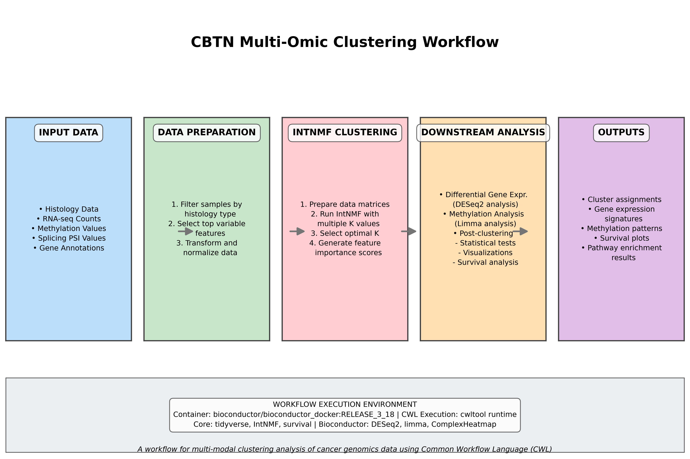
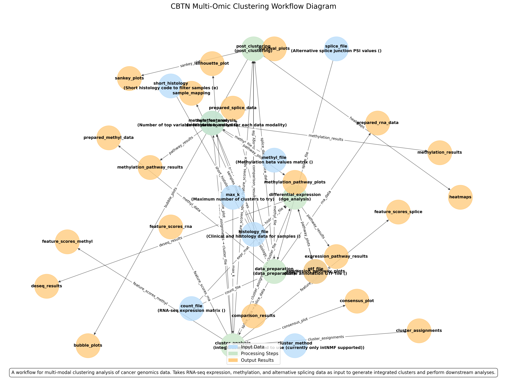
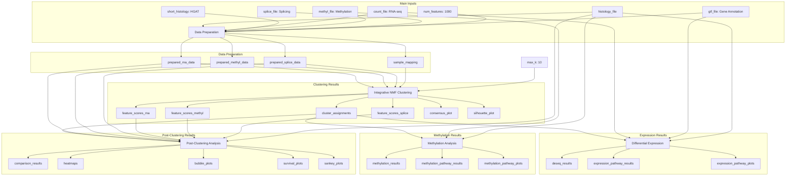

# Multi-Omic Clustering Workflow Visualization

This directory contains visualizations of the CBTN Multi-Omic Clustering Workflow.

## Workflow Diagrams

Two workflow diagrams are available:

1. **Simplified Workflow Diagram** - A clear, high-level representation of the pipeline showing the main processing steps and data flow.
   

2. **Detailed Workflow Diagram** - A comprehensive view based directly on the CWL workflow definition, showing all inputs, steps, and outputs with their interconnections.
   

3. **Mermaid Diagram** - An interactive diagram using the Mermaid.js format (compatible with GitHub markdown).



## How to Generate Diagrams

The diagrams are generated using Python scripts in this directory:

```bash
# Generate the detailed diagram
python3 generate_workflow_diagram.py

# Generate the simplified diagram
python3 simplified_workflow_diagram.py
```

### Requirements

To generate the diagrams, you need Python with the following libraries:
- networkx
- matplotlib
- pyyaml

Install them with:
```bash
pip install networkx matplotlib pyyaml
```

## Text-Based Representation

A text-based ASCII representation is also available in [workflow_diagram.txt](workflow_diagram.txt), providing a quick overview of the workflow structure that can be viewed directly in the terminal or text editor.

## Workflow Components

### 1. Data Preparation
- **Purpose**: Filter and transform data for clustering
- **Inputs**: Histology data, gene counts, methylation values, splice data, GTF file
- **Outputs**: Filtered data matrices for RNA, methylation, and splicing
- **Key operations**: 
  - Subset to specific histology (HGAT)
  - Select top N variable features
  - Transform data

### 2. Integrative NMF Clustering
- **Purpose**: Perform multi-modal clustering
- **Inputs**: Processed RNA, methylation, and splicing data matrices
- **Outputs**: Cluster assignments, feature importance scores, quality plots
- **Key operations**:
  - Run IntNMF with different k values
  - Select optimal number of clusters
  - Generate cluster assignments and silhouette scores

### 3. Differential Expression Analysis
- **Purpose**: Identify cluster-specific gene expression patterns
- **Inputs**: RNA data, cluster assignments
- **Outputs**: Differentially expressed genes, pathway enrichment results
- **Key operations**:
  - DESeq2 differential expression
  - GSEA pathway analysis
  - Visualization of enriched pathways

### 4. Methylation Analysis
- **Purpose**: Identify cluster-specific methylation patterns
- **Inputs**: Methylation data, cluster assignments
- **Outputs**: Differentially methylated probes, pathway enrichment results
- **Key operations**:
  - Limma differential methylation
  - Methylation-specific pathway analysis
  - Visualization of enriched pathways

### 5. Post-Clustering Analysis
- **Purpose**: Generate visualizations and statistics for clusters
- **Inputs**: Cluster assignments, feature scores, original data
- **Outputs**: Heatmaps, bubble plots, survival curves, etc.
- **Key operations**:
  - Statistical comparisons between clusters and known subtypes
  - Survival analysis
  - Visualization of cluster features

## Data Flow

1. **Input Data** → **Data Preparation**
   - Raw data matrices are filtered and transformed

2. **Prepared Data** → **Clustering**
   - Filtered matrices are used for integrative clustering

3. **Cluster Results** → **Downstream Analyses**
   - Cluster assignments drive differential expression, methylation, and post-clustering analyses

4. **Final Results**
   - Multiple visualization outputs and statistical results
   - Complete characterization of molecular subtypes

## Container Requirements

The workflow uses a Docker container with the following key R packages:
- IntNMF (clustering)
- DESeq2 (differential expression)
- limma (methylation analysis)
- clusterProfiler (pathway analysis)
- survival/survminer (survival analysis)
- ggplot2/ggpubr (visualization)
- ComplexHeatmap (heatmap generation)