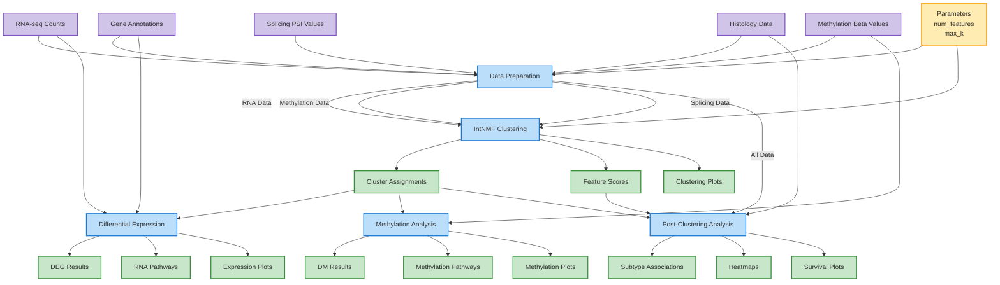

# Workflow Diagram

## Step-by-Step Workflow Description

### 1. Data Preparation
- **Inputs**: Histology data, RNA-seq counts, methylation beta values, splicing PSI values, gene annotations
- **Parameters**: Number of features to select
- **Process**: Filters data to select samples of interest, identifies most variable features, and performs normalization
- **Outputs**: Filtered and transformed data matrices

### 2. IntNMF Clustering
- **Inputs**: Preprocessed RNA, methylation, and splicing data
- **Parameters**: Maximum number of clusters (k)
- **Process**: Performs integrative non-negative matrix factorization to identify multi-omic clusters
- **Outputs**: Cluster assignments, feature scores for each modality, consensus and silhouette plots

### 3. Differential Gene Expression
- **Inputs**: Cluster assignments, RNA-seq counts, gene annotations
- **Process**: Identifies differentially expressed genes between clusters using DESeq2
- **Outputs**: DEG results, pathway enrichment results, gene expression plots

### 4. Methylation Analysis
- **Inputs**: Cluster assignments, methylation data
- **Process**: Identifies differentially methylated regions and performs methylation-specific pathway analysis
- **Outputs**: DM results, methylation pathway enrichment, methylation plots

### 5. Post-Clustering Analysis
- **Inputs**: Cluster assignments, feature scores, all data modalities, histology data
- **Process**: Performs statistical comparisons with known subtypes, creates visualizations, generates survival plots
- **Outputs**: Association statistics, heatmaps, bubble plots, survival curves, Sankey diagrams

## Data Flow Patterns

The workflow demonstrates several key data flow patterns:

1. **Linear Pipeline**: Data preparation → clustering
2. **Fan-out**: Clustering results feed into three parallel analysis streams
3. **Integration**: Multiple data types are integrated during clustering
4. **Reference Data**: Gene annotations are used at multiple steps